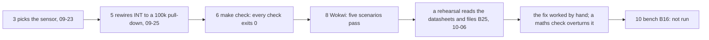
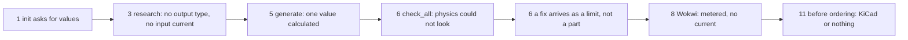
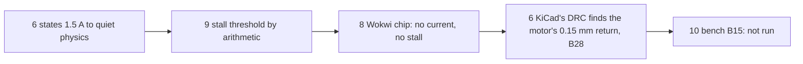

# Jobs and journeys
<!-- Tags as in the brief: E with a pointer, H with its source, D with who and when; an unknown is —. -->

Paths are relative to spark's root; `bin:` marks the bin (smartbin-local at 8847eb8). The six reads of 2026-10-06 are
in `docs/discovery/2026-10-06-p136-inputs/`, written `inputs/` below. Journey steps carry `scrum/STORY_MAP.md`'s
step numbers (0–12).

Two limits on what follows. Every job's clauses cite the PO's own request: they are his examples (n = 1), not jobs
observed in hobbyists. And the maker's journeys read the bin's log, where 79 of 94 commits since 2026-09-20 carry a
Claude trailer, so it shows what the project recorded, not what he saw or did (`council/journey.md:60`).

## Who
<!-- One line per persona: who · evidence status (E pointer | H source). -->
- **The hobbyist** (primary): an idea in words, whatever ESP32 board is in the drawer, some modules; "no EDA, maybe no meter, no Wokwi licence"; quits "when `init` asks for values they cannot measure" · H: the PO's choice; no person outside the project has installed spark (`scrum/VISION.md:38`) <!-- REQUIRED:who -->
- **The maker, Petr** (the test bench): the bin, a hand-written board that spark checks and never generated · E `scrum/VISION.md:39`; n = 1; "Nothing has ever touched hardware" (bin:CLAUDE.md:183)
- **The agent at the keyboard** (a constraint): every logged run was one; it acts on a script's answer without reading the script · E `scrum/VISION.md:40`

## Jobs
<!-- One job story per line, each clause tagged: When …, I want to …, so I can …. -->
- **J1 Choose a value.** When I add a pull-up, an LED, a divider into an ADC or a motor's supply to a design [E #70 question 1], I want spark to calculate the part from the parts' recorded facts [E #70 body, "calculating parts when creating a new circuit"], so I can buy a part that holds at the worst corner [H, from the reads' finding that checks print limits, not parts: `inputs/remedies.md:109-115`] <!-- REQUIRED:jobs -->
- **J2 Validate a finished design.** When my design builds [E #70 question 1, "validating a finished design"], I want every check to report what it found and what it did not examine [E #70 comment 5; P141, #75], so I can trust a pass [H, W1's reason: `scrum/WORKING_AGREEMENTS.md:11-16`]
- **J3 Fix what a check found.** When a check, a review or the bench finds a fault such as B25 [E #70 comment 3; bin #19], I want fixes with calculated parts, each re-checked [E #70 comment 3; `inputs/remedies.md:297-311`], so I can choose one knowing what it costs [H, from the PO's "add either this or make that"]
- **J4 Simulate a piece or the whole.** When a question depends on time or load, such as motor start, stall or supply droop [E #70 question 3], I want to simulate just that piece or the whole board [E #70 body], so I can learn it before building [H]
- **J5 Let the firmware meet the circuit.** When my firmware runs in Wokwi [E #70 question 5], I want the simulated modules to show their electrical behaviour, a stall or a real ADC reading [E #70 question 5], so firmware that depends on it is tested before hardware [H]
- **J6 Check before ordering.** When I am about to order a board [E #70 question 1, "checking before ordering"], I want board checks such as DRC and ERC to run [E #70 body, "No DRC, ERC, EMC or analogue (SPICE) checks"], so I do not pay for a board that fails [H]
- **J7 Plan the bench.** When the checks have done what they can [E #70 question 1, "planning the bench"], I want to know what only the bench can settle and how to measure it with what I own [E #70 question 3], so one bench session settles it [H]
- **J8 Get a circuit for a need.** When I have a need [E #70 comment 4], I want spark to suggest a circuit from my modules or parts, with calculated values [E #70 comment 4], so I can pick one [E #70 comment 4]. The kinds step is P76's (#5); P136 would supply its calculators and checks [H, `inputs/suggestions.md:601`]

## Today they…
<!-- Per job: what they do instead today (a competitor, a workaround or nothing), tagged. -->
- J1 · spark calculates one value, an LED's series resistor, rounded up to E12 (E `scripts/emit_board.py:595-618`); every other value is the conversation's arithmetic, and two careful workings of B25 from the same datasheets disagreed on one input (E `inputs/remedies-verify-maths.md:14-22`); KiCad users have kicad-happy's what-if calculators, which snap to standard values (E `inputs/remedies.md:161`, its code read at 0684046) <!-- REQUIRED:today -->
- J2 · `check_all` runs five checks; physics gave a test board with SPI, UART, I2S, 1-Wire and an analogue input `status: ok` (E `inputs/checks-architecture-verify.md:49`); on the bin, physics, rules-vs-design and buildability all exit 0 and none mentions B25 (E `inputs/remedies-verify-claims.md:28`); the AI reviewers judge, and do "not remember between sessions" (E `skills/spark-review/SKILL.md:86`)
- J3 · checks print a limit, not a part; 0 of 17 fault reports re-check a fix, and 3 of the 7 printed limits fail the rule that printed them (E `inputs/remedies.md:76-83`, `:116-122`, held by `inputs/remedies-verify-claims.md:9-13`); B25's fixes were worked by hand, and the maths check overturned the passive ones (E `inputs/remedies-verify-maths.md:14-22`)
- J4 · nothing in spark (E #70 body); spark's own reference defers SPICE as "meaningless for a digital module board with a motor load" (E `skills/spark-design/references/verification-loop.md:28-29`); a person would run LTspice or ngspice by hand (H)
- J5 · hand-written chips: the L9110S chip models no current (E `inputs/data-chips-format-verify.md:203`); the bin's VL6180X chip drives its interrupt push-pull, so Wokwi passed what B25 fails (E bin #19 body); the five Wokwi scenarios pass (E bin:CLAUDE.md:100)
- J6 · the fab gate checks two footprint fields of a board definition and reads nothing of `board.tsx` (E #60 body); "No check here is a design-rule check" (E `README.md:167`); the review skill says to run `kicad-cli sch erc` and `pcb drc` if KiCad is installed (E `skills/spark-review/SKILL.md:77-79`); the bin counts `pcb_*error` entries in its built `circuit.json` (E bin:CLAUDE.md:62); KiCad's DRC at its default rules, run on the bin's export on 2026-10-06, found 585 violations, one of which became a filed circuit fault, B28 (E bin #22)
- J7 · the bin's `bringup/01..06` and its test protocol, written by hand and never run (E `scrum/STORY_MAP.md:65`); the B25 read named its own bench criteria (E `inputs/remedies.md:266-276`)
- J8 · `/spark:idea` writes needs and matches records; no kinds step; the list keeps 8 and hides fitting candidates whose words differ (E `inputs/suggestions-verify.md:13`; `inputs/suggestions.md:65-74`)

## Journeys
<!-- One ### per actor and scenario: the table, then a Mermaid flowchart of the same steps. Never a Mermaid
journey block: it forces a score on every task. "n/a — a one-step job" may replace both. -->
Lens findings are cited by id: JO (the user's journey), RI (risks), in `council/`. Each row is today's journey.

### The maker — B25: a level fault that no rung saw (J2, J3, J7) <!-- REQUIRED:journey -->
| step | what they do | evidence | friction or harm | today | open question |
| --- | --- | --- | --- | --- | --- |
| 3 | 2026-09-23: picks the VL6180X from an option table of interface, range, cost, driver and verdict; deep sleep arrives 21 minutes later | E bin:parts/SENSOR_OPTIONS.md:15-26; bin@125e73a, bin@1809f1f (JO-20) | the conditions that later decide (the output type; watching while asleep) are not columns | partly | Was wake-on-hand a requirement when you chose it? (account) |
| 5 | 2026-09-25: rewires the interrupt line to a 100 kΩ pull-down, active-high, on two reasons: "WAKEUP_ALL_LOW is an AND" and "GPIO1 drives push-pull" | E bin@fd24455, bin@62a3139; bin:firmware/micropython/smartbin/vl6180x.py:203-206 (JO-10) | nobody computes the line's level; the AND reason was later shown "reasoned, never observed" | not yet | What was worked out about that line's voltage? (account) |
| 6 | runs `make check`: its four spark scripts (boards validate, vendor pins, BOM, physics) pass; `wake-polarity.ts` checks only the OPEN button; spark's rules-vs-design script, re-run on the bin's files by this discovery, says every rule holds | E `inputs/remedies-verify-claims.md:28`; bin:Makefile:182-232 (EX-8); the brief's ★C1 runs; bin #19 | silence reads as a pass; the record's 47 kΩ fact is read by no code | not yet | — |
| 8 | five Wokwi scenarios pass | E bin:CLAUDE.md:100; bin:firmware/micropython/sim/chips/vl6180x.chip.c:69,174 | the chip drives the line push-pull, so a level fault cannot appear in the digital simulation | not yet | What did the green runs show you about the wake line? (account) |
| 6 | 2026-10-06: a rehearsal discovery reads schematics and datasheets by hand and files B25 | E bin #19, its Archive line (JO-5) | found by reading, not by any check | — | — |
| 6 | the fix is worked by agents in scratch scripts; a maths check adds GPIO1's own input current (up to 10 µA) and overturns every passive option | E `inputs/remedies-verify-maths.md:14-27` (JO-11) | two workings of one datasheet disagree; the arithmetic lives in the conversation | not yet | Which of the numbers did you check yourself? (account) |
| 10 | the bench check B16 waits: D12 measured with a hand over the sensor, asleep | E bin #19, Value proven by; bin #10 | nothing has touched hardware; the owned carrier is unconfirmed (JO-7) | not yet | — |

### The hobbyist — from the documented example to a checked board, choosing values (J1, J2, J3, J5, J6)
| step | what they do | evidence | friction or harm | today | open question |
| --- | --- | --- | --- | --- | --- |
| 1 | `/spark:init` asks for bus speed, supply and chemistry, and for numbers they may not have: the bus capacitance, a rail's peak "including inrush and stall" | E commands/init.md:63-77; scripts/init_project.py:152,186 (JO-2) | the persona quits "when `init` asks for values they cannot measure" (`scrum/VISION.md:38`, H) | partly | — |
| 3 | `/spark:research` is told to read supply range, thresholds, currents and "on-board pulls (ohms, rail)", not a pin's output type or input current | E commands/research.md:63 (JO-4) | the two facts B25 turned on are not asked for | partly | — |
| 5 | the generator calculates one value, the LED resistor | E scripts/emit_board.py:595-618 | every other value is guessed or worked in the conversation | partly | — |
| 6 | the first `check_all` on the documented example ends `[????] physics`, exit 2; the L9110S CONFLICT goes unreported | E docs/guide/journey.md:427-438 (JO-13); #52, #54, #43 | "a standing could-not-run trains people to skip the line it is printed on" (bin@3b5940c) | partly | — |
| 6 | a fix arrives as a limit; 3 of the 7 printed limits fail their own rule; `check_all` drops the fix | E scripts/check_physics.py:332,422-424; scripts/check_all.py:129,139-141 (JO-12); #87 | buying a part the same rule rejects (H) | not yet | — |
| 8 | Wokwi needs a free account's token with metered minutes; its chips model no current; a chip's analogue output uses a fixed 5 V reference, "regardless of the MCU" | E README.md:83-87; `council/existing-first.md:41` (EX-14); JO-3, JO-14 | metered; a module's behaviour exists only as hand-written C (JO-16) | partly | Is a free account with a metered quota "free"? (decision) |
| 11 | before ordering: spark's own checks measure no spacing; tscircuit's build measures it against its router's 0.1 mm; KiCad's DRC needs a whole application (the macOS image is 1,404,303,659 bytes) | E docs/guide/journey.md:605-606; README.md:160,167 (JO-17); the coordinator's check, 2026-10-06; ★C7 | against the PO's stated preference | partly | Is "could not look" acceptable for net spacing without KiCad? (decision) |

### The maker — the motor: current, stall and the firmware's threshold (J1, J4, J5, J7)
| step | what they do | evidence | friction or harm | today | open question |
| --- | --- | --- | --- | --- | --- |
| 6 | states 1.5 A, "the L9110S's own limit", so physics stops abstaining; rules it "an upper bound" on 2026-10-01 | E bin:.spark/rules.json:27-30; bin@3b5940c, bin@852f1c6 (JO-8) | a stated value with no recorded source; the verified record says 0.8 A | partly | Where did 1.5 A come from? (account) |
| 9 | the firmware's stall detector reads the shunt on A0; its threshold is arithmetic, 4,000 counts for about 0.58 A | E `inputs/suggestions-verify.md:60`; bin #16 | the threshold rests on no measurement | not yet | — |
| 8 | in Wokwi the L9110S chip prints opening, closing and stopped, and models no current, so no stall reaches the firmware | E `inputs/data-chips-format-verify.md:203` (JO-14) | the stall path is untested before hardware | not yet | — |
| 6 | 2026-10-06: KiCad's DRC at its default rules runs on the bin's export (who ran it is not recorded); among the 199 tracks it flags as narrower than 0.2 mm, the motor's current path is filed as B28, verified against board.tsx and the built board; spark's trace-current rule never examined that net, which the rules file does not name | E bin #22; `council/electronics-firmware-physics.md:41` (PH-14) | found by an outside checker, not by spark; a project step, not one the maker is recorded taking | partly | Should a check examine a current-carrying net the rules file does not name? (decision) |
| 10 | B15 asks for a meter in series, running and stalled by hand; a 30-second route through the winding resistance was written on 2026-09-24 and dropped on 2026-10-01 | E bin #9; bin@ca79eae, bin@5b61e86 (JO-15) | no number measured, so any simulation would rest on unmeasured parameters | not yet | Have you put a meter on the motor? (account) |

