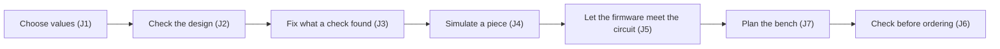

# Story map
<!-- Proposed, not applied: this map stays here until the decider confirms it; nothing changes the product's own
map file. -->
**Status:** proposed, not applied <!-- REQUIRED:map-status -->

The jobs are in [jobs-and-journeys.md](jobs-and-journeys.md); ★ claims are in [the brief](brief.md). Every row is a
proposal, and its slice order is the facilitator's opinion until the PO orders it (W11).

## Backbone
<!-- The activities, left to right, as the user does them. -->
Choose values → Check the design → Fix what a check found → Simulate a piece → Let the firmware meet the circuit → Plan the bench → Check before ordering <!-- REQUIRED:backbone -->

Getting a circuit for a need (J8) sits to the left of this backbone and belongs to P76 (#5); P136 would hand it its
calculators and checks.

## Slices
<!-- Walking skeleton first: the thinnest slice that runs end to end. One row per story. -->
Slice 0 runs one fault class, B25's, thinly through every activity on the bin; the later slices widen one activity
each, and each waits for a design that pulls it (W14).

| slice | activity | story | job | tag | proof |
| --- | --- | --- | --- | --- | --- |
| 0 walking skeleton <!-- REQUIRED:slices --> | Choose values | a calculator prints B25's line level from recorded facts, each input with its source, typical-only inputs marked `?` | J1 | H ★C4, calculated | its output on the bin at 8847eb8 |
| 0 | Check the design | a rule names TOF_INT at 1.89 V against 2.475 V, and the run lists what no rule examined (P155) | J2 | E ★C1 | `check_all` on the bin |
| 0 | Fix what a check found | the rule says that no pull-down value fixes the line, at most 2.33 V, and that a much stronger carrier pull-up or a source tied to 3.3 V can, each with its cost | J3 | H ★C4, calculated | the printed line |
| 0 | Simulate a piece | the run says that no dynamic behaviour was examined | J4 | E ★C10 | the not-examined line |
| 0 | Let the firmware meet the circuit | the run says that the Wokwi chip drives the line push-pull, so the digital simulation cannot show it | J5 | E ★C3, as written | the not-examined line |
| 0 | Plan the bench | the rule prints the reading that settles it: D12 at least 2.48 V with a hand over the sensor, asleep | J7 | E bin #19 | the printed bench line |
| 0 | Check before ordering | the review's gate lists the open finding before an order | J6 | H | the gate's list on the bin |
| 1 | Check the design | the honesty cards already on the board: P143, P141, P122, P107 | J2 | E board, 2026-10-06 | each card's own proof |
| 2 | Choose values | a rail's standing current at rest, summed from the records, and the sleep floor with bounds (B26) | J1, J7 | E PH-8 | MOTOR6V's standing current printed on the bin |
| 3 | Fix what a check found | a catalogue of fixes for an open-drain level, the transistor stage sized at the corners, every check re-run on a copy | J3 | H ★C4, calculated | the candidate list for B25 |
| 4 | Check before ordering | B28's kind: the net named in the rules file now (no code), or found by the rule itself (P156, if Q15 says so); spacing stays tscircuit's; KiCad the team's reference and a user's setting | J6 | H PH-14; E ★C7 for spacing, ERC not run | MOTOR_SENSE named on the bin's files, a known answer, so a mutation must show the rule bites |
| 5 | Let the firmware meet the circuit | a value computed beforehand as a chip attribute: the L9110S's current at load, the VL6180X's line level | J5 | H ★C3, as written | one metered scenario, with his yes |
| 6 | Simulate a piece | one named dynamic question in native ngspice once B15 has measured the motor, if Q2 opens it | J4 | H ★C8, one divider | the run beside the bench reading |

## Delta to the product's map <!-- REQUIRED:spark-process:map-delta -->
<!-- The rows to add or change in the repository's own story map file, in that file's table shape, with its journey
step numbers; proposed, not applied. -->
Proposed, not applied, for `scrum/STORY_MAP.md`. That file names 23 of the board's 74 open items (Found on the way), so
the slices table is shown only for P136's own rows.

The journey table (`| # | step | spark today | gap |`), rows changed:

| # | step | spark today | gap |
| --- | --- | --- | --- |
| 5 | Generate, build | `emit_board.py`, `check_spine.py` | no capacitors (P38); one value calculated, the LED resistor; tscircuit's build checks spacing at its own 0.1 mm, not the fab's (P136) |
| 6 | Check, review | `check_all.py` (5 checks), `/spark:review` | silence where no rule looked (P141); fixes give limits, not parts, and nothing re-checks them (P118, P153); faults inside modules go unseen, such as the bin's B25 and B26 (P136) |
| 8 | Simulate | `check_spine` → Wokwi (paid minutes) | digital only: chips model no current and drive open-drain lines push-pull (P152); no analogue rung, a not-goal for v1 (P136) |
| 11 | PCB and fab — offered once the breadboard works | `emit_board` → tscircuit, `fab.py`, `check_bom`, the review's fab gate | KiCad's DRC needs a whole application; on the bin, at its default rules, it found 585 violations, one of which became a filed circuit fault (B28), a kind spark's trace-current rule misses when the rules file does not name the net (P156) |

The slices table (`| # | slice | for | done when | items |`), P136's rows; which row holds them is Q11:

| # | slice | for | done when | items |
| --- | --- | --- | --- | --- |
| **4** | **v1 on two projects** | hobbyist | unchanged | add **P136** (#70) and, once filed, P155 (under P136) and P156 (under P133) |
<!-- EXTEND:map -->
