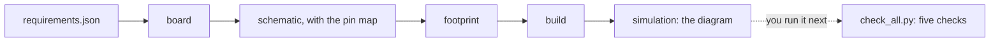

# How spark works underneath

spark is three things:

- a set of Python scripts;
- a library of facts about boards and parts, each a
  [record](../../GLOSSARY.md#record--and-the-four-places-one-lives);
- pages that tell Claude when to run which script.

The [commands](commands.md) and skills are those pages. The scripts do the work, and each one runs on its own. This
page is the map.

## From a requirements file to a built board, then the checks

`/spark:build` runs one script, [`check_spine.py`](../../scripts/check_spine.py), the chain. It takes a
[requirements file](../../GLOSSARY.md#the-requirements-file) (a dev board and a list of parts) through every stage and
says which stage stopped it, if any:

The build's output also prints the chain as the glossary draws it, idea -> parts -> pin map -> schematic -> footprint
-> build -> simulation. The stages it reports are the ones in the table below; the pin map is made inside "schematic",
so a pin that cannot be assigned stops that stage.

In words:

| stage | done by |
| --- | --- |
| board | the dev board's definition, resolved and checked against its contract ([`boards.py`](../../scripts/boards.py)) |
| parts | each part's record from the library ([`parts.py`](../../scripts/parts.py)); reported only when it stops there |
| schematic | `board.tsx` is written ([`emit_board.py`](../../scripts/emit_board.py)), with the pin map made inside it: every signal gets a pin with a reason ([`assign_pins.py`](../../scripts/assign_pins.py)) |
| schematic-notes | reported only when the generator printed a note: a pin no part claims, an output nothing receives, a rail nothing sources, one side of a driven pair (a speaker terminal's) that nothing drives, or a rail two supplies drive. It counts as a problem, so the run exits 1 even when the board builds |
| footprint | the dev board's footprint is made from its board definition ([`emit_footprint.py`](../../scripts/emit_footprint.py)) |
| build | tscircuit builds it, and copper is counted: a build with no copper is not a pass |
| simulation | the Wokwi diagram and chips are generated ([`sim_project.py`](../../scripts/sim_project.py) and the converter in [`tools/circuit-to-wokwi/`](../../tools/circuit-to-wokwi/)), and kept only with `--sim-dir`. No simulation runs |

Two more names can appear, each as could-not-run: `requirements`, for a file that is not a design, and `check_spine`,
for an error the script did not expect.

`/spark:build` stops after the simulation stage. You run [`check_all.py`](../../scripts/check_all.py) next; it runs
the five checks on what was built. The [journey guide](journey.md#build) shows a real run.

The files that join the steps:

| file | written by | read by |
| --- | --- | --- |
| `requirements.json` | you, `parts.py --requirements` from your picks, or the `spark-design` skill with you | the chain, `assign_pins.py`, and `check_all.py` for buildability and physics |
| `board.tsx`, and the dev board's footprint beside it | the schematic and footprint stages, kept with `--keep .` | tscircuit |
| `dist/board/circuit.json`, the built netlist | tscircuit's build | every check, `init_project.py` (to name the rails), and the Wokwi converter |
| `sim/diagram.json`, `sim/wokwi.toml` and the chips | the simulation stage, kept with `--sim-dir sim` | `wokwi-cli`, and Wokwi for VS Code |
| `.spark/rules.json` | `init_project.py`, then you | the checks, and the generator, which sizes a rail's traces from its `max_current_a` |
| `.spark/needs.json` | `parts.py --needs-set`, and `--pick` for a need's pick | `parts.py --match` |
| `parts/<id>.json` | research | the chain, which takes a project's own record first |
| `firmware/pins.py` | `assign_pins.py --emit-pins` | your firmware |

The converter's own [ARCHITECTURE.md](../../tools/circuit-to-wokwi/ARCHITECTURE.md) shows its part of the path.

## The scripts

Each one is described in its own words, the first line of its docstring. Most checks and chain scripts take `--json`.
[The guide for AI agents](agents.md) lists which do and which do not; `check_bom.py`, `emit_board.py` and `flash_image.py` do
not.

### The one command for checks

- `check_all.py`: every deterministic check, in one call, with one answer. It prints what `--project` found for each
  input it resolves by convention. It runs the five checks below. It does not run the generator's CONFLICT test or
  read the notes in `board.tsx` ([P109](https://github.com/xmejkal/spark/issues/43)).

### The checks

Each by its name in check_all's answer:

- **vendor-truth**, `check_vendor_pins.py`: does the board definition match what the vendor says, or only what somebody
  typed? It re-derives the pin map from the vendor's own `pins_arduino.h`.
  - Inside check_all it reads the plugin's cached copy of espressif/arduino-esp32's variant header (committed
    2026-09-24), not a live fetch.
  - Run on its own without `--offline`, it fetches through the GitHub CLI `gh`.
- **buildability**, `check_footprints.py`: will this board be buildable, and will the parts go in it? It checks:
  - a drill against the pin that goes in it;
  - an annular ring against what a board house can make;
  - a via's hole and pad against what a board house can make;
  - a capacitor's value against its package;
  - two identical connectors close together (within 25 mm), whose plugs can be swapped.

  Plated holes it could not read are counted, not dropped.
- **physics**, `check_physics.py`: does the built board obey physics, or only itself? Trace current, capacitor
  derating, resistor dissipation, I²C rise time, and whether each rail's supply covers what it feeds. It needs each
  rail's values from `.spark/rules.json`:
  - With no rail named, it says it could not run.
  - A null `max_current_a` is named on a `?` line that does not change the outcome.
  - A null `nominal_volts` skips the capacitor check without a word
    ([P107](https://github.com/xmejkal/spark/issues/41)).
  - Only `check_all.py --project` checks whether a rail's supply covers what it feeds, because only it has the part
    records.
- **the-order**, `check_bom.py`: does the fab package order the parts the schematic specifies?
- **rules-vs-netlist**, `compare_design.py`: a written rule against the design that was actually built.

### The chain

- `check_spine.py`: the one thing that has to work, a module list in and a board that builds out.
- `assign_pins.py`: which pin each signal should go on, and why. Scarce pins are spent last. `--emit-pins` writes the
  map for the firmware.
- `emit_board.py`: a pin map and a module list, as a board file you can build (here, `board.tsx`).
- `emit_footprint.py`: a board definition, turned into the footprint module its design imports.
- `flash_image.py`: a flash image with MicroPython and the project's files, for a headless simulation.

### The facts

- `boards.py`: which board the project is built around, checked against a contract. `--validate` keeps a board
  definition to facts, never decisions.
- `parts.py`: what a part asks of the board it plugs into, and what is actually known about it. Every fact carries a
  value, a source and whether anyone checked; `--unverified` lists what nobody has. It also keeps the drawer and the
  needs, writes the picks and the requirements file from them, and marks a project's steps and tallies what they cost
  (`--step`, `--tally`; `cost.py` below does the counting).
- `init_project.py`: everything a project needs before any check can run, with nothing guessed.
- `tools.py`: the tools spark depends on, found from one merged list. It is what `/spark:setup` runs.

### The libraries

Imported by the scripts above, and not run on their own, except `cost.py`:

- `design.py`: a design, loaded once: the requirements file, its project, the board, the parts and the rules;
- `netlist.py`: the built design, as connectivity;
- `copper.py`: how much current a piece of copper carries;
- `fab.py`: what a board house can make;
- `outcomes.py`: the exit codes and the three outcomes, defined once;
- `store.py`: where spark keeps what it keeps;
- `drawer.py`: what you own;
- `needs.py`: what a goal needs, and what the store offers for each;
- `cost.py`: what a project's run cost, read from the Claude Code transcripts of the sessions its steps ran in, tool
  names and counts only. `parts.py --step` and `--tally` use it. On one transcript it runs on its own:
  `cost.py <transcript.jsonl>` says what that run cost;
- `sim_project.py`: the simulation project a design implies, written by `check_spine.py`'s simulation stage.

## The data

| folder or file | holds |
| --- | --- |
| [`boards/`](../../boards/) | board definitions: the DFRobot FireBeetle 2 ESP32-S3 and the Seeed XIAO ESP32-C6. [`boards/README.md`](../../boards/README.md) has the schema, and the rule that a board definition carries facts, never decisions |
| [`parts/`](../../parts/) | part records, each fact with its source and whether anyone checked it |
| [`data/fabrication.json`](../../data/fabrication.json) | what a board house can make (minimum annular ring, via and drill sizes) and what a physical part is (package power ratings). Every script reads it rather than restating it |

**Your own files win.** A project's own `boards/<id>.json` or `parts/*.json` beats the shipped one of the same name.
For parts, a record on your shelf also beats spark's library, in every project; the project's own record beats both.
Your board house's numbers go in `.spark/rules.json` under `fabrication`.

### Your own dev board

spark's library defines the FireBeetle 2 ESP32-S3 and the Seeed XIAO ESP32-C6. Another board needs its own definition, a JSON file in the project's `boards/`; this was
not run for these docs. [`boards/README.md`](../../boards/README.md) explains the format, but its steps are the smart
bin's, and name a Makefile and files spark does not have ([P127](https://github.com/xmejkal/spark/issues/61)). With
spark's own scripts:

1. **Copy the closest definition** from spark's `boards/` to the project's `boards/<id>.json`, and take the pin map
   from the vendor's own `pins_arduino.h`. A copy keeps the old board's header geometry (`physical.header`,
   `header_order`, `width_mm`, `height_mm`), and the footprint is made from it unchanged, so measure it again from the
   vendor's drawing.
2. **`boards.py --validate --project .`** checks every board definition against the contract: facts, never decisions.
3. **`emit_footprint.py --board <id> --project .`** makes the footprint, or names each field it still needs. With no
   header geometry at all, it names only `physical.header`.
4. **`check_vendor_pins.py boards/<id>.json`** compares the pin map with the vendor's header that
   `vendor.arduino_variant` names, fetched through the GitHub CLI `gh`.
5. **Name the id as `board`** in the requirements file. The chain takes the project's definition before the library's.

No contract check catches missing header geometry: `boards.py --validate --for-fab` answers ok on the XIAO, which has
none ([P121](https://github.com/xmejkal/spark/issues/55)); `parts.py --audit` and `--match` say such a board stops at the
footprint stage. Nothing compares copied geometry with the new board either.

## Your store

spark keeps what is yours in one folder outside every repository: `SPARK_HOME`, else `XDG_DATA_HOME/spark`, else
`~/.local/share/spark` ([`store.py`](../../scripts/store.py)). It holds:

- the documents research kept;
- the catalog of parts research read and did not choose;
- your drawer;
- your shelf: records that every project then finds. One gets there when a drawer entry links a record from another of
  your projects, or when `parts.py --requirements` writes a file for a pick that came from the catalog or from another
  of your projects (a shelf for every part you choose is [P91](https://github.com/xmejkal/spark/issues/22));
- your history, `history.jsonl`: one line for each event, appended, and private to you (0600 files in 0700 folders,
  refused inside a git work tree). The events are `step` (a project's step started, with the Claude Code session it
  ran in), `reused` (a pick taken from the library, your store or another project), `passed_over` (a part you passed
  over, with your reason) and `built` (a board that built end to end, with a digest of the facts the build read from
  the board and from each part). It keeps ids, project names, your reasons without any URL or price, and session ids.
  `parts.py --tally` reads the Claude Code transcripts of those sessions (`~/.claude/projects`, tool names and counts
  only) for the cost line;
- the list of your projects;
- your tools list;
- the tools `/spark:setup` downloads (`downloads/`);
- what a drawer import brought in (`drawer-import/`).

## The tools spark calls

`/spark:setup` lists them, one job per line, with what fills each job on this machine:
`tools.py --status --project .` ([a real run](journey.md#build)).

`[ok  ]` on an MCP row (chip-docs, parts-search) means only that spark declares the server and Node is on the PATH.
Nothing checks that Claude Code has the server registered or that it answers
([P112](https://github.com/xmejkal/spark/issues/46)), or the Node version; espressif-docs needs Node 20 or newer
([docs/mcp.md](../mcp.md)).

What each job is:

| job | tool |
| --- | --- |
| bench | `sigrok`, off unless you turn it on |
| board-engine | tscircuit, installed into the project at the version spark pins |
| chip-docs | the espressif-docs MCP server, for `datasheet-reader` |
| diagram-converter | spark's own, in `tools/circuit-to-wokwi/` |
| firmware-image | MicroPython for the S3 |
| js-runtime | Node: runs the bundled diagram converter, npm (which installs tscircuit) and spark's two MCP servers |
| littlefs | `littlefs-python`: packs the firmware's files into the flash image |
| parts-search | the jlcpcb MCP server, for `part-finder` |
| pdf-text | reads datasheets |
| simulator | `wokwi-cli`. Compiling chips is local and free; a scenario run spends Wokwi CI minutes |
| ts-runtime | bun: runs tscircuit's `tsci`, which starts with `#!/usr/bin/env bun`, and a project's own converter |
| wokwi-mcp | Wokwi's MCP server, off unless you turn it on |

**MCP servers.** spark declares two in [`.mcp.json`](../../.mcp.json), both started with `npx -y` and no pinned version
([P112](https://github.com/xmejkal/spark/issues/46)):

- **jlcpcb** (`@jlcpcb/mcp`, an unofficial community package), part search for `part-finder`;
- **espressif-docs** (`mcp-remote` to Espressif's hosted server), Espressif's own documentation for
  `datasheet-reader`. It needs Node 20 or newer.

Wokwi's and sigrok's servers are one choice each in `/spark:setup`. [`docs/mcp.md`](../mcp.md) says why, and why
KiCad's is not offered.

**Optional.** KiCad's `kicad-cli` is used by the review and design skills for electrical-rule and design-rule checks
when it is installed. The design skill points to the official tscircuit skill for full syntax
(`npx skills add tscircuit/skill`).
