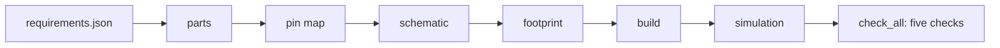

# How spark works underneath

spark is a set of Python scripts, a library of facts about boards and parts, and pages that tell Claude when to run
which script. The [commands](commands.md) and skills are those pages. The scripts do the work, and each one runs on
its own. This page is the map.

## From a requirements file to a checked board

`/spark:build` runs one script, [`check_spine.py`](../../scripts/check_spine.py), the chain. It takes a requirements
file (a board and a list of parts) through every stage and says which stage stopped it, if any:



In words:

| stage | done by |
| --- | --- |
| parts | each part's record from the library ([`parts.py`](../../scripts/parts.py)) |
| pin map | every signal gets a pin with a reason ([`assign_pins.py`](../../scripts/assign_pins.py)) |
| schematic | the board file is written ([`emit_board.py`](../../scripts/emit_board.py)) |
| footprint | the dev board's footprint is made from its board definition ([`emit_footprint.py`](../../scripts/emit_footprint.py)) |
| build | tscircuit builds it, and copper is counted: a build with no copper is not a pass |
| simulation | the Wokwi diagram and chips are written ([`sim_project.py`](../../scripts/sim_project.py) and the converter in [`tools/circuit-to-wokwi/`](../../tools/circuit-to-wokwi/)) |

After that, [`check_all.py`](../../scripts/check_all.py) runs the five checks on what was built. The
[journey guide](journey.md#build) shows a real run.

## The scripts

Each one is described in its own words, the first line of its docstring. The checks and the chain take `--json`;
the [agents guide](agents.md) has the list.

**The one command for checks**

- `check_all.py`: every deterministic check, in one call, with one answer. It prints the path it resolved for each
  input before reporting anything.

**The checks**

- `check_vendor_pins.py`: does the board definition match what the vendor says, or only what somebody typed? It
  re-derives the pin map from the vendor's own `pins_arduino.h`.
- `check_footprints.py`: will this board be buildable, and will the parts go in it? It checks:
  - a drill against the pin that goes in it;
  - an annular ring against what a board house can make;
  - a capacitor's value against its package;
  - two identical connectors that can be swapped.

  Plated holes it could not read are counted, not dropped.
- `check_physics.py`: does the built board obey physics, or only itself? Trace current, capacitor derating, resistor
  dissipation, I²C rise time, and whether each rail's supply covers what it feeds. It needs the rails' values from
  `.spark/rules.json`, and says so when they are missing.
- `check_bom.py`: does the fab package order the parts the schematic specifies?
- `compare_design.py`: a written rule against the design that was actually built.

**The chain**

- `check_spine.py`: the one thing that has to work, a module list in and a board that builds out.
- `assign_pins.py`: which pin each signal should go on, and why. Scarce pins are spent last. `--emit-pins` writes the
  map for the firmware.
- `emit_board.py`: a pin map and a module list, as a board file you can build.
- `emit_footprint.py`: a board definition, turned into the footprint module its design imports.
- `sim_project.py`: the simulation project a design implies.
- `flash_image.py`: a flash image with MicroPython and the project's files, for a headless simulation.

**The facts**

- `boards.py`: which board the project is built around, checked against a contract. `--validate` keeps a board file
  to facts, never decisions.
- `parts.py`: what a part asks of the board it plugs into, and what is actually known about it. Every fact carries a
  value, a source and whether anyone checked; `--unverified` lists what nobody has. It also keeps the drawer and the
  needs.
- `init_project.py`: everything a project needs before any check can run, with nothing guessed.
- `tools.py`: the tools spark depends on, found from one merged list. It is what `/spark:setup` runs.

**The libraries** — imported by the scripts above and not run on their own:

- `design.py`: a requirements file, loaded once;
- `netlist.py`: the built design, as connectivity;
- `copper.py`: how much current a piece of copper carries;
- `fab.py`: what a board house can make;
- `outcomes.py`: the exit codes and the three outcomes, defined once;
- `store.py`: where spark keeps what it keeps;
- `drawer.py`: what you own;
- `needs.py`: what a goal needs, and what the store offers for each.

## The data

| folder or file | holds |
| --- | --- |
| [`boards/`](../../boards/) | board definitions: the DFRobot FireBeetle 2 ESP32-S3 and the Seeed XIAO ESP32-C6. [`boards/README.md`](../../boards/README.md) has the schema, and the rule that a board file carries facts, never decisions |
| [`parts/`](../../parts/) | part records, each fact with its source and whether anyone checked it |
| [`data/fabrication.json`](../../data/fabrication.json) | what a board house can make (minimum annular ring, via and drill sizes) and what a physical part is (package power ratings). Every script reads it rather than restating it |

**Your own files win.** A project's own `boards/<id>.json` or `parts/*.json` beats the shipped one of the same name.
Your board house's numbers go in `.spark/rules.json` under `fabrication`.

## Your store

spark keeps what is yours in one folder outside every repository: `SPARK_HOME`, else `XDG_DATA_HOME/spark`, else
`~/.local/share/spark` ([`store.py`](../../scripts/store.py)). It holds:

- the documents research kept;
- the catalog of parts research read and did not choose;
- your drawer;
- your shelf;
- the list of your projects;
- your tools list.

## The tools spark calls

`/spark:setup` lists them, one job per line, with what fills each job on this machine:

```sh
python3 "$CLAUDE_PLUGIN_ROOT/scripts/tools.py" --status --project .
```

<!-- output: run 2026-10-05, spark 0.6.0 -->
```text
  spark's tools — personal: ~/.local/share/spark/tools.json · project: .spark/tools.json

  [off ] bench             sigrok is off unless you turn it on — /spark:setup add sigrok
  [ok  ] board-engine      tscircuit — my-gadget/node_modules/.bin/tsci
  [ok  ] chip-docs         espressif-docs (MCP, spark's own)
  [ok  ] diagram-converter circuit-to-wokwi — $CLAUDE_PLUGIN_ROOT/tools/circuit-to-wokwi/dist/converter.mjs
  [????] firmware-image    firmware-image (micropython-esp32s3) is not installed — install: /spark:setup add micropython-esp32s3
  [ok  ] js-runtime        node — ~/.nvm/versions/node/v22.23.2/bin/node
  [ok  ] littlefs          littlefs-python — ~/.pyenv/versions/3.10.0/bin/python3
  [ok  ] parts-search      jlcpcb (MCP, spark's own)
  [ok  ] pdf-text          pdftotext — /opt/homebrew/bin/pdftotext
  [ok  ] simulator         wokwi-cli — ~/.local/bin/wokwi-cli
  [ok  ] ts-runtime        bun — /opt/homebrew/bin/bun
  [off ] wokwi-mcp         wokwi-mcp is off unless you turn it on — /spark:setup add wokwi-mcp

  1 to install: micropython-esp32s3
```

What each job is:

| job | tool |
| --- | --- |
| board engine | tscircuit, installed into the project at the version spark pins |
| diagram converter | spark's own, in `tools/circuit-to-wokwi/` |
| simulator | `wokwi-cli`. Compiling chips is local and free; a scenario run spends Wokwi CI minutes |
| firmware image | MicroPython for the S3, with `littlefs-python` to pack the project's files |
| pdf-text | reads datasheets |
| bench | `sigrok`, off unless you turn it on |

**MCP servers.** spark declares two in [`.mcp.json`](../../.mcp.json):

- **jlcpcb**, part search for `part-finder`;
- **espressif-docs**, Espressif's own documentation for `datasheet-reader`. It needs Node 20 or newer.

Wokwi's and sigrok's servers are one choice each in `/spark:setup`. [`docs/mcp.md`](../mcp.md) says why, and why
KiCad's is not offered.

**Optional.** KiCad's `kicad-cli` is used by the review and design skills for electrical-rule and design-rule checks
when it is installed. The design skill points to the official tscircuit skill for full syntax
(`npx skills add tscircuit/skill`).
